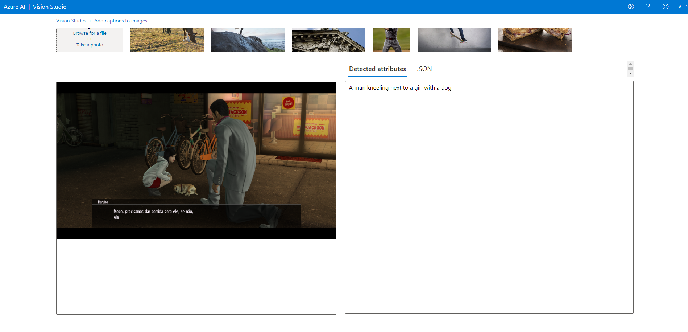

## Facial Recognition, Text Recognition and Image/Video Description in Vision Studio

  

   
  

> Project developed as a challenge - AI-900 Preparation!

## About the project

I created a service in Azure AI Vision Studio and experimented with some uses of artificial intelligence, such as recognizing a face, a text, describing what is happening in an image, and searching for an event/object in a video.
  
## **How to get started**

First, I clicked on "Create a resource" and created a new "Cognitive Service". After that, I simply selected my resource group that I had previously created in the [previous challenge](https://github.com/GianDutra/Machine-Learning-no-Azure-ML), chose a name that I thought was suitable, and the "Standard S0" plan. After that, I waited and in less than 1 minute I had already created a resource on [Vision Studio website](https://portal.vision.cognitive.azure.com/).

### **First Experiment**

dakodakodkaodkao

### **Second Experiment**

adadadadadada

### **Third Experiment**

adadadadadada

### **Fourth Experiment**

adadadadadada

## Final Considerations
In this project, I learned a lot about Azure Machine Learning, and although I already had some experience in Machine Learning through courses and projects, it was really cool to see how easy, fast, and advanced this matter is within Azure. I will definitely use these services again if I need to perform a regression or any other task, and I'm excited for my next learning opportunity.

## 👨‍💼 Autor

<table>
  <tr>
    <td align="center">
      <a href="#">
         
        
          <b>Gian Dutra</b>
        
      </a>
    </td>
  </tr>
</table>
