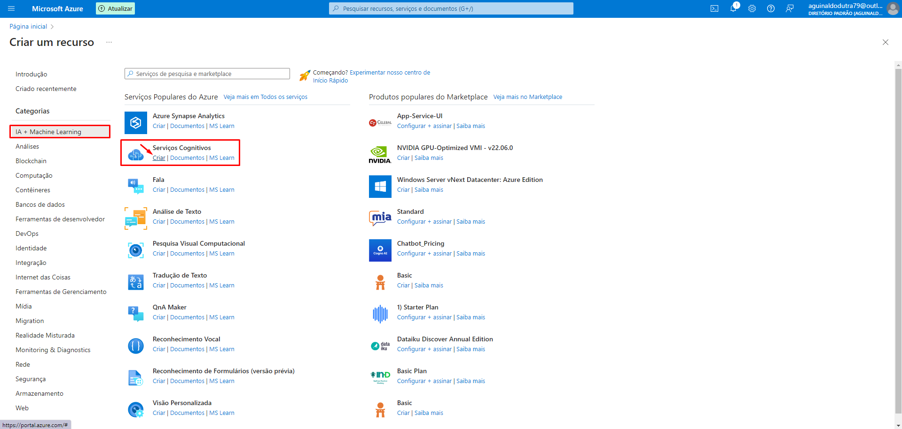

## Facial Recognition, Text Recognition and Image/Video Description in Vision Studio

  

   
  

> Project developed as a challenge - AI-900 Preparation!

## About the project

I created a service in Azure AI Vision Studio and experimented with some uses of artificial intelligence, such as recognizing a face, a text, describing what is happening in an image, and searching for an event/object in a video.
  
## **How to get started**

First, I clicked on "Create a resource" and created a new "Cognitive Service". After that, I simply selected my resource group that I had previously created in the [previous challenge](https://github.com/GianDutra/Machine-Learning-no-Azure-ML), chose a name that I thought was suitable, and the "Standard S0" plan. After that, I waited and in less than 1 minute I had already created a resource on [Vision Studio website](https://portal.vision.cognitive.azure.com/).

### **First Experiment**

I used the facial recognition service to try to recognize a photo of myself.

### **Second Experiment**

I used a Japanese book that I have and tested to see if the text extraction from image service would work even if the text is in Japanese and written in the traditional vertical orientation.

### **Third Experiment**

I used a photo from the game "Yakuza Kiwami" to test the service of adding a description to the photo.

### **Fourth Experiment**

I used a video of a race from the movie "Fast and Furious: Tokyo Drift" and tested the service for recognizing any event or object during the video, aiming to find the instances when the red car appears.

## Final Considerations
I found it incredible how artificial intelligence is managing to learn and detect faces, images, objects, and events. I had a lot of fun conducting these experiments and am excited to see what artificial intelligence will be able to do in a few years... truly, the future is bright.

## 👨‍💼 Autor

<table>
  <tr>
    <td align="center">
      <a href="#">
         
        
          <b>Gian Dutra</b>
        
      </a>
    </td>
  </tr>
</table>
